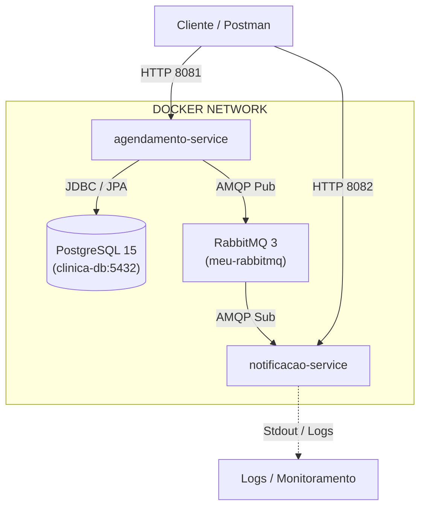

# Tech Challenge - Fase 3 

Arquitetura de Microsserviços e Mensageria

Projeto prático desenvolvido para a **Fase 3 da Pós-Graduação (12ADJT)**. A solução implementa uma arquitetura distribuída e orientada a eventos para o sistema de gestão de clínica médica, desacoplando o fluxo de agendamento de consultas do serviço de notificações por meio de mensageria assíncrona.

---

## Arquitetura da Solução

A solução é composta por dois microsserviços autônomos, um banco de dados relacional e um broker de mensageria:



### 1. `agendamento-service` (Porta 8081)
* **Responsabilidade:** Autenticação (JWT), controle de acesso baseado em papéis (RBAC), gestão cadastral (Médicos, Pacientes, Enfermeiros) e agendamento/remarcação de consultas.
* **Persistência:** Conecta-se ao banco de dados relacional PostgreSQL.
* **Mensageria (Produtor):** Publica eventos assíncronos no RabbitMQ a cada nova consulta agendada ou remarcada.

### 2. `notificacao-service` (Porta 8082)
* **Responsabilidade:** Processamento em segundo plano de comunicações e alertas para pacientes e profissionais de saúde.
* **Mensageria (Consumidor):** Escuta as filas do RabbitMQ e simula o disparo de confirmações/lembretes de consulta em tempo real via logs estruturados.

### 3. `postgres` (Porta 5432)
* Banco de dados relacional PostgreSQL 15, provisionado com persistência e inicialização automática de schema.

### 4. `rabbitmq` (Portas 5672 e 15672)
* Broker de mensageria AMQP com plugin de gerenciamento habilitado (*RabbitMQ Management Dashboard*).

---

## Tecnologias Utilizadas

* **Linguagem & Framework:** Java 21, Spring Boot 4.1.1
* **Segurança:** Spring Security, JWT (JSON Web Token), RBAC (`MEDICO`, `ENFERMEIRO`, `PACIENTE`)
* **Persistência & Dados:** Spring Data JPA, Hibernate, PostgreSQL 15
* **Mensageria:** Spring AMQP, RabbitMQ
* **Containerização:** Docker, Docker Compose, Multi-Stage Builds (Maven 3.9 + Eclipse Temurin 21 JRE Alpine)
* **Testes & Qualidade:** JUnit 5, Mockito, AssertJ e JaCoCo (Cobertura de Código) 
* **Testes Manuais:** Postman Collection com encadeamento automático de variáveis

---

## Pré-requisitos

Para clonar e executar o ecossistema completo, você precisará de:

* [Git](https://git-scm.com/)
* [Docker Desktop](https://www.docker.com/products/docker-desktop/) (com suporte a Docker Compose v2) instalado e em execução 
* [Postman](https://www.postman.com/) (para executar os testes automatizados da collection)

---

## Como Executar o Projeto

1. Clone o repositório:
```bash
git clone https://github.com/gabifontainhas/12adjt-tech-challenge-fase3.git
cd 12adjt-tech-challenge-fase3
```

2. Inicie todo o ecossistema com um único comando:
```bash
docker compose up --build
```

> O Docker Compose compilará o código Java dos dois microsserviços via *Multi-Stage Build*, inicializará o banco de dados e o broker com *healthchecks* e subirá as aplicações apenas quando a infraestrutura estiver pronta para conexões.

3. Para encerrar a execução:
```bash
docker compose down
```

---

## Portas e Acessos aos Serviços

| Serviço | Host / URL | Porta Exposta | Descrição |
| :--- | :--- | :--- | :--- |
| **Agendamento Service** | `http://localhost:8081` | `8081` | Endpoints REST de Autenticação, Cadastros e Consultas |
| **Notificação Service** | `http://localhost:8082` | `8082` | Microsserviço consumidor de eventos |
| **PostgreSQL** | `localhost:5432` | `5432` | Banco de Dados (`tech-challenge-3-clinica`) |
| **RabbitMQ AMQP** | `localhost:5672` | `5672` | Protocolo de transporte de mensagens |
| **RabbitMQ Management** | `http://localhost:15672` | `15672` | Painel Web (Login: `admin` \| Senha: `admin`) |

---

## Bateria de Testes com Postman

O repositório inclui a collection com todos os fluxos encadeados na raiz: `TechChallenge_Fase3.postman_collection.json`.

### Passo a passo para execução:
1. Abra o **Postman** e clique em **Import** (canto superior esquerdo).
2. Selecione o arquivo `TechChallenge_Fase3.postman_collection.json` localizado na raiz do projeto.
3. Certifique-se de que as variáveis de ambiente carregaram corretamente:
- agendamento_url: http://localhost:8081
- notificacao_url: http://localhost:8082
4. Execute as requisições na ordem configurada:
   * **Cadastros Iniciais:** `POST Medico` e `POST Paciente` (IDs gerados são salvos automaticamente).
    * **Fluxo de Autenticação:** `POST Login Medico` e `POST Login Enfermeiro` (os tokens JWT são extraídos automaticamente para as variáveis).
    * **Listar usuários:** `GET Medicos`, `GET Enfermeiros` e `GET Pacientes` com token de Médico ou Enfermeiro.  
    * **Criação da Consulta (Sucesso):** `POST Consulta` com token de Médico ou Enfermeiro.
    * **Alteração da Consulta (Sucesso):** `PUT Consulta` com token de Médico ou Enfermeiro.
    * **Cenários de Exceção / Regras de Negócio:**
        * Tentativa de agendamento em horário indisponível (`400 Bad Request`).
        * Acesso a rotas administrativas com token de Paciente (`403 Forbidden`).
        * Requisição sem autenticação (`401 Unauthorized`).

### Validando a Mensageria Assíncrona:
Após executar o `POST Consulta` ou `PUT Consulta` no Postman, acompanhe a recepção da mensagem pelo microsserviço consumidor abrindo outro terminal:
```bash
docker compose logs -f notificacao-service
```
O log exibirá a simulação do envio da notificação por e-mail com os detalhes da consulta recém-criada.
Em caso de erro, é possível reprocessar a fila de DLQ com o endpoint configurado no postman `POST Reprocessar`.

---

## Cobertura de Testes Automatizados (JaCoCo & JUnit 5)

Os microsserviços possuem suítes de testes unitários cobrindo as regras de negócio de agendamento, validações de horário, autorização e manipulação de entidades.

### Como executar os testes unitários localmente:

Acesse o diretório do serviço que deseja testar (`agendamento-service` ou `notificacao-service`):

- Apenas executar a suíte no terminal:
```bash
mvn test
```

- Executar os testes e gerar o relatório visual (JaCoCo):

```bash
mvn clean verify
```

### Relatório de Cobertura (JaCoCo):
Após a execução com verify, o relatório visual em HTML é gerado automaticamente em:
```text
target/site/jacoco/index.html
```

## Acesso ao Banco de Dados (DBeaver / pgAdmin)

Para inspecionar as tabelas criadas pelo Hibernate:
* **Host:** `localhost`
* **Port:** `5432`
* **Database:** `tech-challenge-3-clinica`
* **Username:** `postgres`
* **Password:** `postgres`

---

## Autora

* **Gabriela Fontainhas de Sordi** - rm372540